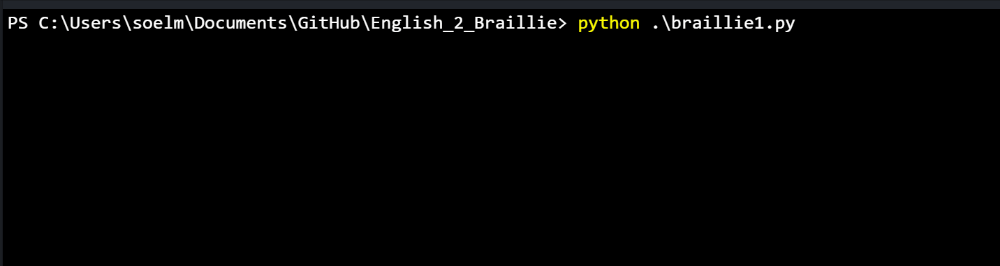
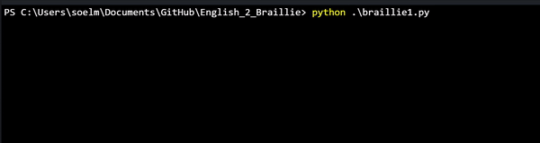

# English_2_Braillie

Convert English to Braillie(grade 1)

The python script is to convert the English and basic math symbols to braillie language(grade 1).

To learn braillie refer to:
1) https://www.youtube.com/watch?v=sqQ3gdE7ks0
2) http://www.acb.org/tennessee/braille.html

Example 1

Example 2

Example 3

Example 4

